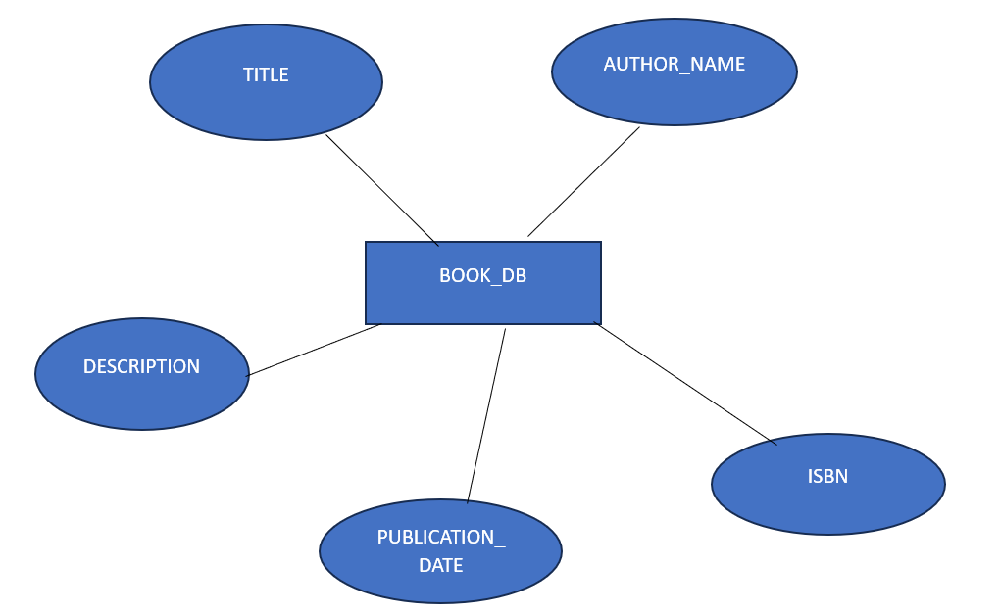
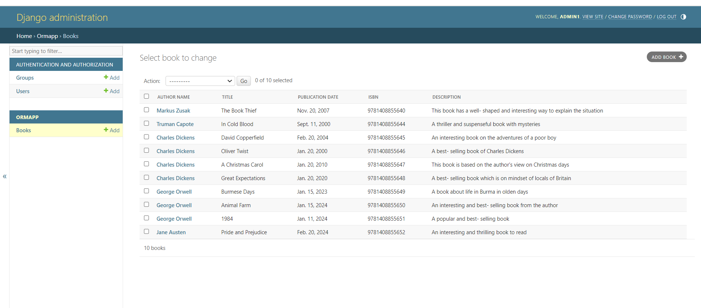

# Ex02 Django ORM Web Application
## Date: 29.02.2023

## AIM
To develop a Django application to store and retrieve data from a Book database using Object Relational Mapping(ORM).

## Entity Relationship Diagram




## DESIGN STEPS

### STEP 1:
Clone the problem from GitHub

### STEP 2:
Create a new app in Django project

### STEP 3:
Enter the code for admin.py and models.py

### STEP 4:
Execute Django admin and create details for 10 books

## PROGRAM

```
models.py

from django.db import models
from django.contrib import admin
class Book(models.Model):
    author_name=models.CharField(max_length=100)
    title=models.CharField(max_length=200)
    publication_date=models.DateField()
    ISBN=models.CharField(max_length=13,unique=True)
    description=models.TextField()
class BookAdmin(admin.ModelAdmin):
    list_display=("author_name","title","publication_date","ISBN","description")

admin.py

from django.contrib import admin
from .models import Book,BookAdmin
admin.site.register(Book,BookAdmin)
```

## OUTPUT



## RESULT
Thus the program for creating a database using ORM hass been executed successfully
